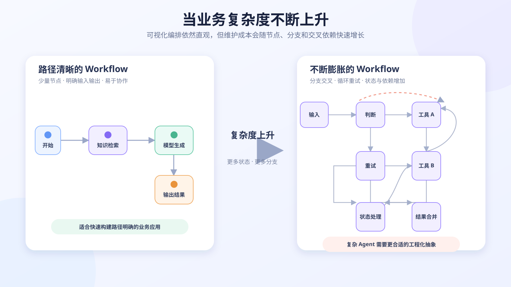
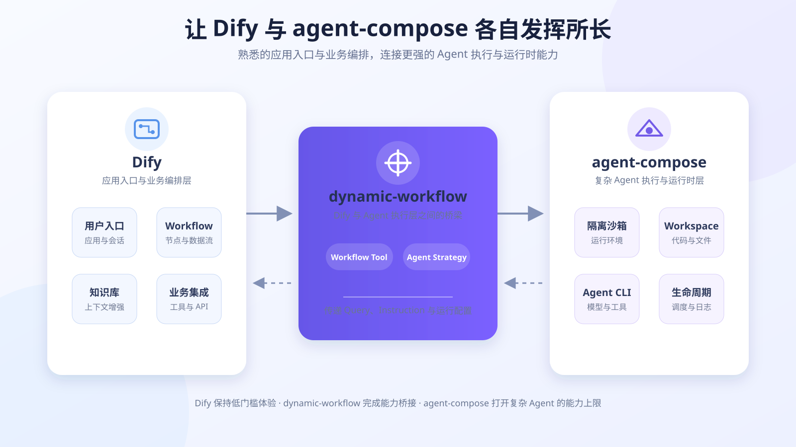

# 从拖拽式 Workflow 到代码化 Agent：用 dynamic-workflow 连接 Dify 与 agent-compose

> 本文介绍 Dify、agent-compose，以及 dynamic-workflow 提供的 Workflow Tool 和 Agent Strategy 两种接入方式。文中的产品界面位置可结合实际版本调整，并可在标注处补充截图。

## 我们为什么要做 dynamic-workflow？

过去一段时间，Dify 已经成为公司内外很多同事搭建 AI 应用的第一站。它把模型、提示词、知识库、条件分支、工具调用等能力封装成可视化节点，用户通过拖拽和连线，就能定义一套可执行的工作流。

这种方式很像一门图形化的 DSL（领域特定语言）：画布上的节点是语句，连线表示数据和控制流，节点配置则是参数。它最大的价值是把 Agent 和 Workflow 的门槛降得足够低——产品、运营、分析师和开发者都可以快速完成原型，并直观地观察数据如何流过整个流程。

我们并不否认这种低门槛。恰恰相反，Dify 已经拥有广泛的用户基础、成熟的交互方式和良好的应用编排体验，这些都是非常有价值的能力。对于问答、分类、信息抽取、内容生成、简单工具调用，以及路径相对确定的业务流程，Dify 往往能够良好工作，而且通常是投入产出比很高的选择。

但随着需求变复杂，画布也会逐渐暴露边界：节点和连线越来越多，复杂循环、动态决策、异常恢复、长时间任务、运行环境依赖以及多轮状态管理越来越难表达。问题不一定在于“节点还不够多”，而在于复杂 Agent 所需要的抽象，已经不完全适合用静态流程图描述。

这正是 agent-compose 和 dynamic-workflow 出现的原因：不是替代 Dify，而是让熟悉 Dify 的用户可以继续使用熟悉的入口，同时把真正复杂的 Agent 执行交给更合适的系统。



## Dify 与 agent-compose：两种不同的 Agent 设计方式

Dify 和 agent-compose 都能承载 Agent，但两者的设计起点并不相同。

Dify 更接近“在平台中配置和编排 AI 应用”。用户在 UI 中选择节点、填写提示词、绑定变量、配置模型和工具，再由 Dify 按照 DSL 描述的流程执行。流程结构被显式展示出来，容易理解、容易演示，也方便非研发同事参与修改。

agent-compose 更接近“用工程化方式声明、运行和管理 Agent”。如果你熟悉 Docker Compose，可以把它理解为 Agent 领域的 Compose：开发者在 `agent-compose.yml` 中声明 Agent 使用的模型提供方、镜像、运行驱动、工作区、环境变量、技能、MCP 服务、持久卷和调度规则，再由常驻 daemon 负责构建、运行、调度和管理沙箱。

一个最小配置大致如下：

```yaml
name: demo

agents:
  reviewer:
    provider: codex
    image: chaitin/agent-compose-guest:latest
    driver:
      docker: {}
    workspace:
      provider: git
      url: https://github.com/example/repo.git
      ref: main
      target: .
```

在 Dify 中，我们主要通过“节点与连线”表达一个已知流程；在 agent-compose 中，我们更多通过“代码、配置与运行时”定义 Agent 能做什么，并允许 Agent 在受控环境中自主使用工具完成任务。

| 对比维度 | Dify | agent-compose |
| --- | --- | --- |
| 主要表达方式 | 可视化节点、连线和表单配置 | `agent-compose.yml`、代码、脚本和工程文件 |
| 主要抽象 | AI 应用与确定性 Workflow 编排 | Agent 定义、隔离运行时与生命周期管理 |
| 流程控制 | 由画布 DSL 显式描述 | 可由 Agent、代码和调度脚本动态决定 |
| 运行环境 | 以平台节点和插件能力为主 | 每个 Agent 拥有独立沙箱、工作区和依赖环境 |
| 适合人群 | 产品、运营、分析师、低代码用户及需要快速编排的开发者 | 需要代码表达力、工程化交付和复杂运行环境的研发团队 |
| 典型场景 | 问答、生成、抽取、分类、固定业务流程 | 代码分析、自动化运维、长任务、事件驱动任务、复杂工具链和自主 Agent |

这里并不存在简单的高下之分。两者解决的是不同复杂度、不同协作方式下的问题。绝大多数路径明确的业务场景，用 Dify 会更快；当流程开始依赖复杂代码、真实工作区、多种命令行工具、动态循环和持续运行状态时，agent-compose 的优势才会真正显现。

## 为什么复杂 Agent 更适合 agent-compose？

### 1. 代码的表达力，不受画布节点数量限制

可视化 DSL 很适合表达“先做 A，再判断 B，然后执行 C”。但当任务包含嵌套循环、并发、重试、复杂数据结构、动态路由、递归拆解或大量异常分支时，流程图会迅速膨胀。

代码天然适合表达这些控制逻辑，也可以直接使用成熟的语言生态、SDK、测试框架和现有业务模块。复杂度仍然存在，但它不再被摊平成几十个节点和交叉连线，而是进入开发者熟悉、可抽象、可复用、可测试的工程结构中。

### 2. 每个 Agent 都有隔离、可复现的运行环境

复杂 Agent 往往不只是“调用一次模型”。它可能需要拉取 Git 仓库、读取和修改文件、执行测试、运行命令、安装依赖，甚至持续保留工作区状态。

agent-compose 通过 Docker、BoxLite 或 Microsandbox 等运行驱动为 Agent 提供隔离沙箱，并用镜像声明运行依赖。相比依赖某台开发机上“恰好已经安装”的工具，这种方式更容易复现、迁移和排查。这里所说的“稳定”，主要指环境边界明确、依赖可声明、运行可重复，而不是对当前 Public Preview 阶段作超出事实的生产稳定性承诺。

### 3. 工作区、技能、MCP 和持久卷可以一起声明

Agent 可以绑定本地目录或 Git 仓库作为工作区，也可以配置 MCP Server、可复用 Skill 和命名 Volume。任务所需的代码、工具和状态不再散落在个人机器或临时提示词中，而是成为 Agent 定义的一部分。

这让“这个 Agent 到底依赖什么”变得更清晰，也更利于团队复用和版本管理。

### 4. 多模型 CLI Agent 可以使用统一控制面

agent-compose 当前支持 Codex、Claude Code、Gemini、OpenCode 和 Pi 等 Provider。不同 Agent 可以按任务特点选择不同运行时，同时仍由同一个 daemon 管理项目、沙箱、日志和生命周期。

模型凭据也可以集中保存在 daemon 侧。对于支持的 Provider，Runtime LLM Facade 会向沙箱下发受限令牌，真实 API Key 无需进入 Guest 环境，从而缩小密钥暴露面。

### 5. 不只响应请求，也能被计划和事件驱动

除了人工发起 Prompt，agent-compose 还支持 cron、interval、timeout、event 和 Webhook 等触发方式，也支持用 JavaScript 编写更灵活的调度逻辑。

因此，一个 Agent 可以是“被用户调用的工具”，也可以是定时巡检、代码审查、事件响应或后台自动化任务。这是传统对话式 Agent 很难自然覆盖的一类场景。

### 6. 生命周期与可观测性更接近工程系统

通过 Compose 风格的 `up`、`run`、`ps`、`logs`、`down`，以及沙箱、镜像、Volume、Cache 和 Scheduler 等管理命令，研发人员可以明确观察和控制 Agent 的运行状态。对长任务和复杂任务而言，“在哪里运行、是否还活着、日志是什么、何时停止、状态是否保留”与最终回答同样重要。

### 7. 配置可以进入版本控制和评审流程

`agent-compose.yml`、调度脚本及相关代码都可以进入 Git，像普通工程代码一样进行 Diff、Code Review、测试、回滚和发布。相比只存在于某个平台实例中的页面配置，这种方式更适合多人维护和持续演进。

## dynamic-workflow：保留 Dify 的入口，接入更强的 Agent 执行能力

对于已经熟悉 Dify 的同事，我们并不希望大家为了使用 agent-compose，立刻放弃现有的应用、工作流和交互习惯。

dynamic-workflow 做的事情很直接：在 Dify 与 agent-compose 之间建立一座桥。用户仍然在 Dify 中接收输入、组织业务流程、引用知识库和处理结果；当某一步需要更强的 Agent 能力时，通过插件把任务委托给 agent-compose。agent-compose 在隔离沙箱中完成真正的执行，再把最终文本和结构化运行信息返回 Dify。

```text
Dify 应用 / Workflow
        │
        │  Query、Instruction、Agent 配置
        ▼
dynamic-workflow 插件
        │
        │  HTTP / Connect API
        ▼
agent-compose daemon
        │
        ▼
隔离 Sandbox + Workspace + Agent CLI + Tools
```

这样，我们可以同时保留两边的优势：Dify 继续承担低门槛入口、业务编排和应用交付；agent-compose 承担复杂 Agent 的工程化定义、隔离执行和生命周期管理。



## 两种接入方式：Workflow Tool 与 Agent Strategy

dynamic-workflow 目前提供两个独立的 Dify 插件包：

- `agent_compose_workflow-<version>.difypkg`：在 Workflow 中以 Tool 节点运行 agent-compose Agent。
- `agent_compose_strategy-<version>.difypkg`：在 Dify Agent 节点中选择 agent-compose Strategy，把节点执行委托给 agent-compose。

由于 Dify plugin daemon 不允许一个插件包同时混合 Tool 与 Agent Strategy 入口，两种方式需要分别安装。它们最终都会调用 agent-compose，但在 Dify 中的执行位置、配置入口和适用方式并不相同。

| 对比维度 | Workflow Tool | Agent Strategy |
| --- | --- | --- |
| Dify 中的位置 | Workflow/Chatflow 中的 Tool 节点 | Agent 节点内部的策略 |
| 执行语义 | 流程走到该节点时，执行一次选定 Agent | Agent 节点的执行整体委托给 agent-compose |
| 与上下游关系 | 输入输出通过节点连线显式传递 | 遵循 Dify Agent 节点的输入输出语义 |
| Agent 选择 | 支持从 agent-compose 动态拉取下拉选项 | 当前填写文本，推荐 `project/agent` |
| 连接配置生效位置 | Tool Provider 凭据，全局供该 Provider 使用 | 当前 Agent 节点的 Strategy 参数 |
| 更适合 | 固定流程中的一个复杂处理步骤 | 希望整个 Agent 节点由 agent-compose 驱动 |

### Workflow Tool：把 Agent 当作流程中的一个能力节点

Tool 模式最容易理解。它与其他 Tool 节点一样：当 Dify Workflow 执行到这里时，插件将 `query` 和可选 `instruction` 发送给选中的 agent-compose Agent，等待执行结束，然后把结果交给下游节点。

它适合以下情况：

- 整体流程仍然适合由 Dify DSL 描述，只是某一步需要读写代码、执行命令或调用复杂工具链；
- 希望在 Agent 执行前后继续使用条件分支、模板转换、知识库、HTTP 请求或其他 Dify 节点；
- 希望从动态下拉框中直接选择已发布的 agent-compose Agent；
- 任务通常是一次性的、边界明确的 Workflow Step。

配置方式：

1. 在 Dify 插件页面导入 `agent_compose_workflow-<version>.difypkg`。
2. 在 Tool Provider 中配置 `agent_compose_url`、可选的 `agent_compose_token` 和超时时间。
3. 在 Workflow 中添加 Tool 节点。
4. 选择 **agent-compose Workflow → Run agent-compose Agent**。
5. 从动态列表选择 Agent，填写或绑定 `query`；需要时补充 `instruction`。
6. 根据任务选择沙箱清理策略，并把 `text` 或结构化输出连接到下游节点。

> 【配图建议 3：Tool Provider 凭据配置页】
>
> 【配图建议 4：Workflow 中选择 Run agent-compose Agent，并展示 Agent 动态下拉框】

### Agent Strategy：把 Agent 节点的执行交给 agent-compose

Strategy 模式不是在画布中增加一个普通 Tool，而是改变 Dify Agent 节点“由谁来执行”。用户仍然看到一个 Agent 节点，但该节点收到 Query 后，会由 agent-compose Strategy 将任务转交给指定的 agent-compose Agent。

它适合以下情况：

- Dify 主要承担应用入口、会话和外围编排，核心智能行为希望由 agent-compose Agent 完成；
- 不希望在 Dify 中再次搭建一套复杂的模型—工具推理循环；
- 希望从语义上明确表达：“这里不是调用一个小工具，而是委托给另一个完整 Agent”；
- 需要在多轮对话中复用同一个 agent-compose 沙箱和工作区状态。

配置方式：

1. 在 Dify 插件页面导入 `agent_compose_strategy-<version>.difypkg`。
2. 在 Workflow 或 Chatflow 中添加 Agent 节点。
3. 将 Strategy 选择为 **agent-compose Strategy**。
4. 在节点内配置 `agent_compose_url`、Token 和超时时间。若部署环境已经设置统一默认值，也可以使用环境配置作为兜底。
5. 在 `agent` 中填写 `project/agent`，例如 `adp-demo-agents/print_date`。只有当 Agent 名称在所有项目中唯一时，才建议只写 Agent 名。
6. 绑定 `query`，按需填写 `instruction`、清理策略和输出 Schema。

Strategy 目前使用文本填写 Agent 名称，这是因为 Dify 的 Agent Strategy 参数暂不提供与 Tool 相同的动态选项回调能力。这也是两种模式在配置体验上的一个直观差异。

> 【配图建议 5：Agent 节点选择 agent-compose Strategy】
>
> 【配图建议 6：Strategy 参数配置，重点框出 `project/agent` 与 `cleanup_policy`】

## 沙箱状态与清理策略：一次性任务和多轮任务如何选择

两种插件都会返回 agent-compose 创建的 `run_id`、`sandbox_id`、`status`、`error` 和 `warnings`。最终答案位于 Dify 节点内置的 `text` 输出中，完整响应也可以从内置 `json` 输出读取。

沙箱清理策略有三种：

- `stop_on_completion`：任务完成后停止沙箱。当前 Tool 与 Strategy 均默认使用该模式，适合大多数一次性任务。
- `keep_running`：任务完成后保持沙箱运行，适合需要跨轮保留文件、进程或运行状态的会话。
- `remove_on_completion`：任务完成后删除沙箱，适合不需要保留环境、希望及时释放资源的任务。

当使用 `keep_running` 时，插件会根据 Dify 的 conversation id、project id 和 Agent 名称保存 agent-compose 返回的 sandbox id。后续在同一 Dify 会话中再次调用同一 Agent，便可以自动复用原沙箱；同一会话中的不同 Agent 会使用不同沙箱，避免运行环境串用。

非会话型执行如果没有 conversation id，则每次都会创建新沙箱。`stop_on_completion` 和 `remove_on_completion` 也不会读写这份会话存储。插件有意不暴露手工填写 `sandbox_id` 的参数，以减少错误复用运行环境的风险。

简单来说：

- 固定 Workflow 的一次性步骤：优先 `stop_on_completion`；
- 多轮 Agent 希望延续工作区：选择 `keep_running`；
- 任务结束后不保留任何运行环境：选择 `remove_on_completion`。

## 如何选择：从问题复杂度出发，而不是从工具偏好出发

如果一个需求能够清楚地画成十几个节点，并且主要由提示词、知识库、API 调用和条件判断组成，Dify 通常就是合适的工具。它上线快、沟通直观，也让更多角色能够参与建设。

如果一个需求开始出现下面这些信号，就可以考虑把核心执行迁移到 agent-compose：

- 画布中出现大量循环、分支和重复节点，已经难以阅读；
- Agent 需要真实文件系统、Git 仓库、命令行工具或特定依赖；
- 任务运行时间长，需要保留状态、日志和工作区；
- 需要事件触发、定时调度或后台持续运行；
- 需要通过代码测试、Review、版本控制和发布 Agent；
- 同一个 Agent 需要在不同入口、不同系统中被复用。

在 Dify 内部，还可以进一步选择：如果 agent-compose 只是流程中的一个步骤，用 Workflow Tool；如果这一节点本身就是一个完整 Agent 的入口，用 Agent Strategy。

## 结语：让合适的抽象解决合适的问题

Dify 让更多人能够以低门槛方式搭建 AI 应用，这是它最重要的价值之一。agent-compose 则面向另一类问题：当 Agent 需要代码级表达力、真实工作区、隔离运行环境、复杂工具链和完整生命周期时，我们需要一个更工程化的执行底座。

dynamic-workflow 并不是要求用户在两者之间二选一。它希望形成一种渐进式路径：简单场景继续使用 Dify，复杂能力交给 agent-compose，而 Dify 仍然可以作为大家熟悉的入口和编排平台。

对多数用户来说，第一步不需要重构整个应用。只需要找到当前 Workflow 中最复杂、最难维护、最依赖运行环境的那一个节点，尝试把它交给 agent-compose。这样既保留了 Dify 的易用性，也为 Agent 的能力上限打开了新的空间。

> 说明：agent-compose 当前仍处于 Public Preview，API、运行时打包方式和部署默认值可能继续变化。适合用于实验、内部开发和预览部署；正式生产使用前，应结合具体版本完成安全、容量、稳定性和升级验证。
